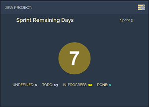

# Mozaïk jira widgets

## Jira Client Configuration

In order to use the Mozaïk weather widgets, you **must** configure its **client**.

### parameters

key     | env key           | required | description
--------|-------------------|----------|-----------------------------------
`baseUrl` | JIRA_API_BASE_URL| yes      | *jira site url*
`basicAuthKey` | JIRA_API_BASIC_AUTH_KEY| yes | *base64 encoded key of jira account*

#### using `config.js`

```javascript
{
  //…
  api: {
    jira: {
            baseUrl: 'your_jira_base_url',
            basicAuthKey: 'your_base64_key'
        }
  }
}
```

#### using environment variable

Simply set **JIRA_API_BASE_URL** and **JIRA_API_BASIC_AUTH_KEY** env variable, using `.env` or manually.

## Jira — Current Sprint

> Show remaining days and tasks status of active sprint for given project



### parameters

key       | required | description
----------|----------|----------------------------------------------------
`project` | yes      | *The jira project to watch*
`board_id`| yes      | *The jira board id of the project*

### usage

```javascript
{
  type: 'jira.current_sprint',
  project: process.env.JIRA_PROJECT,
  board_id: process.env.JIRA_BOARD_ID,
  columns: 1, rows: 1,
  x: 1, y: 1
  },

```